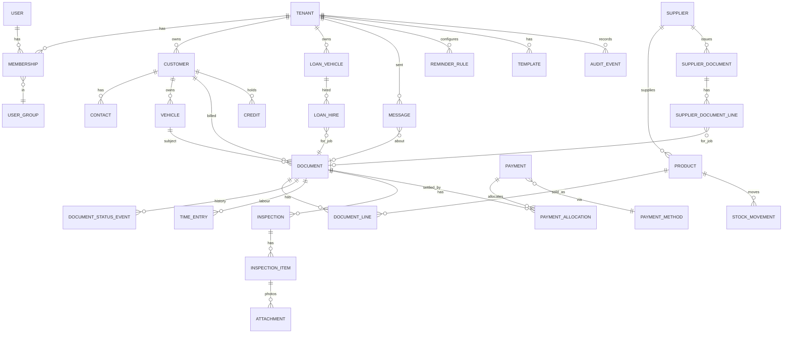

# Product Requirements Document (PRD) v2 — MOTION Workshop Manager

> **Version:** 2.0 · **Date:** 4 September 2026 · **Supersedes:** PRD v1 (Feb 2026)
> **Benchmark:** [Workshop Software](https://workshopsoftware.com) — the incumbent in AU/NZ/UK/US and, via its Africa office, in Namibia and South Africa. Full evidence in [`docs/benchmark/workshop-software-feature-inventory.md`](docs/benchmark/workshop-software-feature-inventory.md); requirements below cite it as *WS-…*.
> **Change log vs v1:** Appendix A.

---

## 0. Why this revision

v1 described a generic "bookings → jobs → invoices" SaaS. Since then the frontend was built by cloning Workshop Software screens, but the backend, data model and requirements never caught up: MOTION has the *look* of the benchmark on ~30 mocked pages and roughly **a third of its substance**. This revision re-baselines the product on what a Namibian or South African workshop that has trialled Workshop Software (as the *TipTop AutoCare* trial account in `References/` did) will expect to find, and states explicitly what we will match, improve, and leave out.

**Positioning in one line:** *Workshop Software-class workshop management, built for Southern Africa — N$/R pricing, VAT, licence-disc and roadworthy reminders, WhatsApp-first communication, EFT with proof-of-payment — at a local price point.*

---

## 1. Product overview

MOTION Workshop Manager is a multi-tenant SaaS for automotive, motorcycle, fleet and general mechanical workshops. One system runs the day: bookings on a diary, a job card on the floor, an inspection on the mechanic's phone, an invoice at the counter, a payment, a statement at month-end, and the reminder that brings the customer back.

### 1.1 Goals
1. **Parity with Workshop Software Silver + Gold** for day-to-day operations (§3 tiers) within two releases.
2. **Be the better choice in Namibia / South Africa** on price, localisation and communication channels.
3. **Real profit on every screen** — cost travels with every line, so the dashboard and every sales report show margin without extra work (*WS §4.2*).

### 1.2 Non-goals (v2)
AU/US parts-catalogue integrations, Carfax / DVLA lookups, integrated card terminals (WorkshopPay is not offered in Africa), hosted-website builder. See §11.

---

## 2. Target market & users

**Market:** independent workshops, dealership service departments and small fleets in **Namibia first, South Africa second**; 1–3 sites, 2–15 staff. The benchmark's Silver tier ($149–169/month) sets the price ceiling.

**User groups** (adopt the benchmark's model, *WS-USER*, trimmed to six):

| Group | Typical person | Can |
|:--|:--|:--|
| **Owner** | proprietor | everything incl. billing, users, settings, all reports |
| **Admin / Manager** | office manager | everything except subscription & billing |
| **Service Advisor** | front counter | bookings, quotes, jobs, invoices, payments, customers, vehicles, inspections, SMS/email |
| **Mechanic (mobile)** | technician on a phone/tablet | own jobs, clock on/off, inspections, photos, notes; *customer data limited* |
| **Invoice & Pay** | counter / cashier | create invoices and take payments only |
| **Read-only** | accountant, franchisor | reports, statements, exports |

Users can belong to more than one workshop (multi-site owners, roaming mechanics).

---

## 3. Benchmark summary & release tiers

Workshop Software sells three tiers; MOTION's releases map onto them so we can say exactly which competitor tier each release matches.

| MOTION release | Matches WS tier | Scope headline |
|:--|:--|:--|
| **R1 — Core** | Silver ($149–169) | Customers, vehicles, products, suppliers; quote → booking → job card → invoice → credit; booking diary; transaction centre; payments, deposits, statements; settings & lists; note/email/SMS templates; mechanic time; core reports; CSV import/export; dashboard with profit |
| **R2 — Growth** | Gold ($179–199) | Electronic inspections with customer approval; automated reminders; online booking; mobile PWA (clock-on, photos, inspections); stock take, stock orders, supplier invoices & payments, serial numbers, bundles, price matrix; loan cars; full report catalogue & BI dashboards; customer portal; accounting export |
| **R3 — Scale** | Platinum ($249–299) | Multi-site; public API & booking API; accounting integrations (Xero, Sage, QuickBooks); WhatsApp Business API; local payment gateway; local parts-supplier integrations |

---

## 4. Gap analysis — MOTION today vs the benchmark

Legend: ✅ built and usable · 🟡 partial (model or mock UI only, not usable) · 🔴 missing

| Module | Workshop Software delivers (*WS ref*) | MOTION today | Status |
|:--|:--|:--|:--:|
| Dashboard | Recent activity with **Sales / Cost / Profit**, WIP & completed tabs, MTD & tax toggles, weekly analysis (*WS-DASH*) | 4 hard-coded KPI cards; `ReportsDashboard` mock already lays out the same tabs; 3 report endpoints | 🟡 |
| Booking Diary | Month/week/day, mechanic lanes, shop hours, appointment types, staff schedule (*WS-DIARY*) | Calendar mock; `Booking` model has no customer/vehicle FK and no lines | 🟡 |
| Transaction Centre | One filterable list of bookings / jobs / orders / supplier invoices, 9 statuses, contacted flag (*WS-TXN*) | Kanban with 5 statuses on mock data | 🟡 |
| Quote / Job / Invoice document | Single document with type (Invoice/Credit/Quote), cost per line, discounts, freight, process/void, follow-up date, odometer & next-service capture, note templates, deposits (*WS-DOC*) | Three separate models (`Booking`, `JobCard`+parts/labour, `Invoice`+lines); tax calc exists; no quote, credit, cash sale, process/void, discount, freight, deposit | 🟡 |
| Customers | ~35 fields, 3 contacts, archive, price type, source list, row actions SMS/Email/Booking/Invoice/Vehicles (*WS-CUST*) | Model mirrors ~80 % of fields; list & form mocks mirror the layout; CRUD API; no archive, contacts, actions | 🟡 |
| Vehicles | ~40 fields, attachments, history tabs, VIN validation, archive (*WS-VEH*) | Model mirrors ~70 % of fields; CRUD API; **no UI page** | 🟡 |
| Products & stock | Types, groups/categories, serials, bundles, stock take, reorder, price matrix, purchase history (*WS-PROD*) | Model mirrors fields; CRUD API; **no UI**; `supplier_id` is a string; no stock movements | 🟡 |
| Suppliers & purchasing | Stock orders, supplier invoices/credits, supplier payments, activity log (*WS-SUP*) | Master-data model + CRUD API only | 🟡 |
| Inspections | Groups → templates → instances, estimated cost, photos, one-click customer approval, notify on approval/refusal (*WS-INSP*) | Model with RAG items + approve flag; checklist mock; no templates, media, approval link | 🟡 |
| Mechanics & time | Clock on/off, time log per job, performance & timesheet reports (*WS-MECH*) | `JobLabor.hours` only; admin list mocks | 🔴 |
| Payments, credits, statements | Payment methods, receipts, deposits, credits (create/apply/refund), statements 30/60/90 (*WS-PAY*) | `Payment` model with EFT proof-of-payment URL (good local fit); dashboard mock; **payment never updates the invoice** | 🟡 |
| Communications & reminders | Templates for every footer/email/SMS, booking confirmations, automated service / rego / WOF / booking / quote-follow-up reminders, communication centre, bulk SMS (*WS-SET, WS-ACT*) | Nothing; settings sidebar links to a `messaging` page that does not exist | 🔴 |
| Reports | ~30 reports in 7 groups + statements + BI, PDF/CSV (*WS-RPT*) | 3 JSON endpoints (revenue, aging, productivity) | 🔴 |
| Settings & lists | ~60 company settings, next-numbers, variable labels, company lists, messages, reminders, schedule, inspection settings (*WS-SET*) | Company/Tax/Booking forms mock ~55 of the fields; `Tenant.settings` JSONB exists with no schema; lists/messages/reminders/schedule pages missing | 🟡 |
| Users, roles, security | 8 groups, Active/Inactive/Blocked, 2FA, SSO, mobile-user flags, dealer access (*WS-USER*) | 3 roles + mobile flags on `User`; admin UI mocks; **no login, no sessions, no tenant enforcement** | 🔴 |
| Import / export | CSV import of customers, vehicles, suppliers, products (+price files), history, bundles, serials; export (*WS-ACT*) | Nothing | 🔴 |
| Public booking & portal | Public URL, appointment types, branding, diary-full %, customer portal (*WS-SET*) | 3-step widget mock; portal mock | 🟡 |
| Mobile | Native app: clock-on, photos/video, inspections, limited customer data (*WS-MOB*) | PWA dashboard mock | 🟡 |
| Loan cars | Register, diary, start/return/review, T&Cs, history report (*WS-LOAN*) | Nothing | 🔴 |
| Integrations | Xero / QuickBooks / MYOB, parts suppliers, VIN decode, MailChimp, Podium, POS, payments, public API (*WS-INT*) | Nothing | 🔴 |
| Multi-site | Platinum: multi-site & franchise head office | `Tenant` model only | 🔴 |

**Reading the table:** MOTION's master-data models (customer, vehicle, product, supplier) were copied faithfully from the benchmark and are the strongest asset. The transactional core (one document with cost, status, process/void), everything that talks to the customer (SMS/email/reminders), everything that pays the workshop (payments → invoice → statement), and everything that secures a tenant (auth, roles, isolation) are absent.

---

## 5. Information architecture

Adopt the benchmark's IA — it is what trial users already know — with three deliberate changes: a **Jobs board** (kanban) alongside the Transaction Centre, **WhatsApp** beside SMS on every contact action, and a single **Settings** hub instead of Settings + Actions.

- **Top bar:** Dashboard · Booking Diary · Transaction Centre · Jobs board · global search (customers, vehicles by plate/VIN, documents by number) · ⚡ Quick-create (Booking, Quote, Invoice, Payment, Inspection, Stock Order, Supplier Invoice, Supplier Payment) · 🕒 Clock on/off · profile
- **Sidebar:** Customers · Vehicles · Suppliers · Products (Stock take) · Loan cars · Reports (Business reports, Statements, BI) · Admin (Users, Mechanics, Service advisors) · Settings
- **Settings hub:** Company · Tax & invoicing · Booking diary & public booking · Lists (sources, payment methods, product groups/categories, appointment types) · Templates (notes, email, SMS/WhatsApp, documents) · Reminders · Inspections (groups, templates, settings) · Price matrix · Schedule · Import / Export · Communication log · Subscription
- **Mobile PWA:** Today's jobs · Clock on/off · Job card (notes, parts, time, photos) · Inspection · Bookings · limited customer view

Routes are tenant-scoped: `/{workshop-slug}/…`; the public booking page is `/{workshop-slug}/book`; the portal is `/{workshop-slug}/portal`.

---

## 6. Functional requirements

Priority: **M** must (R1) · **S** should (R2) · **C** could (R3). Each requirement names the benchmark evidence.

### 6.1 Dashboard (*WS-DASH*)
| ID | Requirement | Pri |
|:--|:--|:--:|
| DASH-01 | Recent Activity grid with tabs *Transactions · Jobs in progress · Recently completed*; columns user, document, date, **sales, cost, profit**; paginated 5/10 | M |
| DASH-02 | KPI widgets: sales, cost, profit, jobs open, bookings today, outstanding receivables; *include VAT* and *month-to-date* toggles; date range | M |
| DASH-03 | Weekly analysis: sales & profit per day for the selected week with prev/next navigation | S |
| DASH-04 | Attention list: overdue invoices, quotes awaiting follow-up, inspections awaiting approval, vehicles due for service this week | S |

### 6.2 Booking Diary & schedule (*WS-DIARY*)
| ID | Requirement | Pri |
|:--|:--|:--:|
| DIARY-01 | Month / week / day views; *Today*; drag-and-drop reschedule; colour by status | M |
| DIARY-02 | Booking = the transaction document (§6.4) with scheduled date/time, due-by, event times, assigned mechanic lane | M |
| DIARY-03 | Lanes from *Mechanics for booking diary*; capacity from *Shop opens/closes* × *Default work hours/day*; *Diary full at %* warning | M |
| DIARY-04 | Appointment types (description, estimated hours) used by internal and public booking | M |
| DIARY-05 | Weekly staff schedule with default hours, overridable per week (*WS Schedule*) | S |
| DIARY-06 | Booking confirmation by email / SMS / WhatsApp on save (template-driven) and automated booking reminders N days before (§6.12) | S |
| DIARY-07 | *Start Job* converts a booking to a job card in one click, keeping all lines and notes | M |

### 6.3 Transaction Centre (*WS-TXN*)
| ID | Requirement | Pri |
|:--|:--|:--:|
| TXN-01 | One list with tabs *Bookings · Jobs · Quotes · Invoices · Credits · Stock orders · Supplier invoices*; filter by date, type, job status, mechanic, advisor; free-text filter; page size 10/25/50 | M |
| TXN-02 | Columns: date, customer, make, model, plate, doc no., job status, **status comment**, **contacted** flag, total; *Create new* | M |
| TXN-03 | Jobs board: kanban of open job cards by status with mechanic avatar, plate, hours & parts count (keep existing `JobKanbanBoard`) | M |
| TXN-04 | Bulk print of today's job cards (*WS "Bulk daily job card printing"*) | S |

### 6.4 The transaction document (*WS-DOC*, *WS-JOB*)
One record, `document_type ∈ {QUOTE, BOOKING, JOB_CARD, INVOICE, CASH_SALE, CREDIT}`, that moves through types and statuses. This replaces v1's separate Booking / JobCard / Invoice entities.

| ID | Requirement | Pri |
|:--|:--|:--:|
| DOC-01 | Header: customer (or *Cash Sale*), optional vehicle, document no., job card no., customer order no., reference, post date, due date, **follow-up date**, **odometer, hours, next service km / date**, job status + status comment, *internal* flag, payment terms, customer source, service advisor, assigned mechanic | M |
| DOC-02 | Lines: product lookup (by code, description, tags), description, qty, unit price, **unit cost**, line type (*Stock · Labour · Sublet · Consumable · Accessory · Tyre*), VAT rate, per-line discount, line total; freight line; header discount (amount or %); running totals; show/hide cost column by permission | M |
| DOC-03 | Job statuses (9, ordered): Booked In → Work In Progress → Waiting For Parts → Inspection In Progress → Waiting For Customer Approval → Job Complete → Customer Notified → Complete – Awaiting Finalise → Finalised; status history with user & timestamp | M |
| DOC-04 | Lifecycle actions: *Save*, *Start Job*, *Convert to Job Card*, *Process* (posts invoice, assigns number, locks lines, updates stock, creates receivable), *Void* (reversal with reason), *Copy*, *Create Credit* (from invoice, full or partial), *Add Deposit*, *Rework* | M |
| DOC-05 | Notes: event notes, job card notes (mechanic-facing), invoice notes (customer-facing), rich text; **note templates** (§6.14) insertable | M |
| DOC-06 | Print / PDF / email: quote, job card (with/without pricing, barcode), invoice, cash-invoice receipt, credit note; letterhead & footer from settings; email/SMS/WhatsApp send logged as *Contacted* | M |
| DOC-07 | Stock effects: processing an invoice decrements `qty_on_hand`; reserving on job card optional (*Reserved stock* setting); block processing while a stock order is attached (setting) | S |
| DOC-08 | Deposits / pre-payments held against a quote or job and applied on processing (*WS "Get paid upfront"*) | S |
| DOC-09 | Mechanic times on the document (§6.10) and *Enter mechanic times* action; labour lines can be auto-created from clocked time | S |
| DOC-10 | Serial numbers captured on lines for products flagged *requires serial number*; tyre DOT/TIN capture | C |
| DOC-11 | Numbering: separate tenant sequences for invoice, credit, PO, receipt, supplier payment; option *invoice no. = job no.* | M |

### 6.5 Customers (*WS-CUST*)
| ID | Requirement | Pri |
|:--|:--|:--:|
| CUST-01 | List: name, mobile, phone, balance; *Active* toggle; filter; page size; row actions **Edit · Vehicles · Booking · Invoice · WhatsApp/SMS · Email** | M |
| CUST-02 | Fields as per model plus: **biller** (parent account), **price type** (Retail / Price 2 / 3 / 4), payment terms (preset list incl. after-end-of-month), **customer source** (configurable list), VAT-exempt flag, credit limit, up to 3 contacts, note | M |
| CUST-03 | Archive / unarchive (never hard delete); duplicate warning on name + mobile | M |
| CUST-04 | Customer page tabs: vehicles, bookings, quotes, invoices, payments & credits, statements, communication log, activity log | M |
| CUST-05 | Statement per customer (§6.11); *Send statement* from the row | M |
| CUST-06 | Business (fleet) customers: multiple vehicles, order numbers required on invoice, fleet code shown (setting) | S |
| CUST-07 | Change customer on an unprocessed document; merge duplicates | S |

### 6.6 Vehicles (*WS-VEH*)
| ID | Requirement | Pri |
|:--|:--|:--:|
| VEH-01 | List: plate, make, model, customer; search by plate / VIN; page size | M |
| VEH-02 | Fields per model plus vehicle group (body type list), VIN 17-char validation, **licence-disc expiry** and **roadworthy expiry** (localised replacements for rego/WOF), key code, radio pin; *Advanced vehicle fields* toggle hides the long tail | M |
| VEH-03 | Vehicle page tabs: invoices (history), bookings, inspections, **attachments** (photos, documents), imported history | M |
| VEH-04 | Service tracking: last service, next service date/km, interval; auto-updated when an invoice with odometer & next-service is processed | M |
| VEH-05 | Transfer vehicle to another customer keeping history; archive | M |
| VEH-06 | Variable labels: *Rego/Plate*, *VIN*, *Fleet code*, *Vehicle* title configurable per tenant (*WS Variable Labels*) | S |
| VEH-07 | Plate / VIN decode via a data provider (none identified for Namibia yet) | C |

### 6.7 Products & stock (*WS-PROD*)
| ID | Requirement | Pri |
|:--|:--|:--:|
| PROD-01 | List: item code, description, brand, retail, cost, qty; filter; type filter | M |
| PROD-02 | Fields per model with **type** enum, **group** and **category** from lists, supplier FK, VAT-exempt, service flag, *don't update qty*, price 2/3/4, default labour qty, requires serial no. | M |
| PROD-03 | Product page tabs: sales (invoices), stock orders, purchase history, stock-take log, serial numbers | S |
| PROD-04 | Stock movements ledger (sale, purchase, adjustment, stock take) → qty on hand, reserved, available; average vs current cost setting | S |
| PROD-05 | Stock take: full count sheets and *single add*; variance report | S |
| PROD-06 | Reorder: min/max → suggested order; stock status (suggested / on order / received) | S |
| PROD-07 | Bundles / canned services (parent product with items; print style setting) | S |
| PROD-08 | Price matrix: markup bands by cost range or supplier/group | S |
| PROD-09 | Supplier price-file import (CSV) updating cost & retail by item code | S |

### 6.8 Suppliers & purchasing (*WS-SUP*)
| ID | Requirement | Pri |
|:--|:--|:--:|
| SUP-01 | Supplier master per model + account number, payment terms, 2 contacts, note; archive | M |
| SUP-02 | Supplier page tabs: stock orders, supplier invoices, supplier payments, activity log | S |
| SUP-03 | Stock order (PO): lines from a job (*Add to order*) or manual; email to supplier; receive (full/partial) → stock movements | S |
| SUP-04 | Supplier invoice / credit: ref, supplier invoice no., post date, price-includes-VAT, lines linked to job card no., freight; *Change sell price* on receipt; process / void | S |
| SUP-05 | Supplier payments and balances; purchases & item-purchases reports | S |

### 6.9 Inspections (*WS-INSP*)
| ID | Requirement | Pri |
|:--|:--|:--:|
| INSP-01 | Inspection groups → templates (items with category, description, default condition); tenant-editable | S |
| INSP-02 | Inspection instance linked to job/vehicle/mechanic; items with RAG condition, notes, **photos/video**, estimated hours & cost (product lookup) | S |
| INSP-03 | Send to customer (SMS/WhatsApp/email link); customer approves / declines per item **in one click**; approved items become job lines; job status flips to *Waiting For Customer Approval* / back | S |
| INSP-04 | Settings: default product, default advisor, contact details on the customer page, hide estimated cost/hours/product cost/price, notify on approval / refusal | S |
| INSP-05 | Printable inspection report with health score (keep existing `InspectionChecklist` UI) | S |

### 6.10 Mechanics & time (*WS-MECH*)
| ID | Requirement | Pri |
|:--|:--|:--:|
| MECH-01 | Mechanics and service advisors lists (people flagged on the user record); *Use service advisors* setting | M |
| MECH-02 | Manual time entries per job (mechanic, start/end or hours, note) | M |
| MECH-03 | Clock on/off per job from the PWA; running timer; one active job per mechanic | S |
| MECH-04 | Mechanic time log; performance report (hours clocked vs hours invoiced), timesheet, jobs with no labour times | S |

### 6.11 Payments, credits & statements (*WS-PAY*)
| ID | Requirement | Pri |
|:--|:--|:--:|
| PAY-01 | Payment methods list (cash, card, **EFT**, SnapScan/Zapper, voucher…) with code, VAT treatment, integrated flag | M |
| PAY-02 | Record payment against one or many invoices; partial payments; **EFT proof-of-payment attachment** and bank reference; receipt PDF; status pending → completed | M |
| PAY-03 | Processing a payment updates `amount_paid` and invoice status (Partial / Paid); overdue derived from due date | M |
| PAY-04 | Deposits (unapplied credit) and credits: create, apply to invoices, refund | S |
| PAY-05 | Statements: per customer or batch; as-at date; 30/60/90 ageing; include paid; email / print; statement footer & email text from templates | M |
| PAY-06 | Receivables reports: customer balances, outstanding balances, sales by payment method | M |
| PAY-07 | Online payment link on invoice via a local gateway (PayToday, Ozow, PayFast or DPO) | C |

### 6.12 Communications & reminders (*WS-SET Messages/Reminders*, *WS-ACT*)
| ID | Requirement | Pri |
|:--|:--|:--:|
| COM-01 | Channels: email, SMS, **WhatsApp** (click-to-chat in R1, Business API in R3); per-customer preferred channel and opt-out | M |
| COM-02 | Templates: invoice/quote/job card/statement/receipt footers; email texts (invoice, quote, statement, inspection, booking confirmation); SMS/WhatsApp texts (160-char counter) with merge fields (customer, vehicle, plate, amount, link) | M |
| COM-03 | Every send logged on the customer and document (channel, template, user, timestamp, delivery status); *Contacted* flag set | M |
| COM-04 | Communication centre: log of all outbound messages; bulk SMS/WhatsApp to a filtered customer list; SMS credit balance & top-up | S |
| COM-05 | Automated reminders, each with on/off, days-before/after and template: service due, **licence-disc expiry**, **roadworthy expiry**, booking reminder, quote follow-up; daily batch with *Send reminders* review/approve screen | S |
| COM-06 | Vehicle-due reports (service due, licence due, roadworthy due) drive the reminder batches and are exportable | S |

### 6.13 Reports & analytics (*WS-RPT*)
| ID | Requirement | Pri |
|:--|:--|:--:|
| RPT-01 | Report framework: date range, sort/limit options, **PDF and CSV** output, saved parameters | M |
| RPT-02 | R1 set: Sales (by customer/date/plate/type; cash vs account; internal), Item sales, Sales by payment method, Work in progress, Quotes, Follow-ups, Bookings, Customer balances & outstanding, Customer listing & sales, Mechanic performance, Transaction log | M |
| RPT-03 | R2 set: Sales breakup, Stock value / listing / status / stock-take variance, Service due, Licence-disc due, Roadworthy due, Vehicle listing, Loan-car history, Timesheet, No-labour-times, Purchases & item purchases, Supplier listing & balances, Status of invoices/payments | S |
| RPT-04 | BI dashboards: revenue, gross profit %, average invoice, jobs completed, technician utilisation, customer retention, sources — by week/month, exportable | S |
| RPT-05 | Accounting export: sales, receipts and purchases journals as CSV in Xero / Sage / QuickBooks import formats | S |

### 6.14 Settings & company lists (*WS-SET*)
| ID | Requirement | Pri |
|:--|:--|:--:|
| SET-01 | Company profile: name, registration & VAT numbers, address (country → region list), phone, WhatsApp number, email (verified), web, logo, letterhead, timezone, currency, language | M |
| SET-02 | Tax: tax name (VAT), sales & purchase rates, prices-include-VAT, VAT on freight, rounding, discount-includes-VAT; VAT-exempt items & customers | M |
| SET-03 | Invoice & print: format, terms, hide part numbers / labour qty / line prices, barcode on job card, pricing on job card, letterhead on/off, running totals, hours-worked field, bilingual labels (EN/AF), use-today-as-post-date, invoice-no = job-no | M |
| SET-04 | Booking: shop opens/closes, work hours/day, mechanics on diary, diary-full %, description → status comment; Public booking: URL slug, appointment types, logo, colours, send link in reminders | M |
| SET-05 | Product & vehicle: default labour product, cost type, reserved stock, include on-order qty, flat rate, vehicle groups, default service interval, default contact method, advanced vehicle fields, show fleet code | S |
| SET-06 | Next numbers (invoice, credit, PO, receipt, supplier payment) and **variable labels** | M |
| SET-07 | Company lists: customer sources, payment methods, product groups (with GL accounts), product categories, appointment types, job statuses' display names | M |
| SET-08 | Templates: invoice note, job card note, document, email, SMS/WhatsApp (§6.12) | M |
| SET-09 | Settings are a typed JSON schema (validated), versioned per tenant, with an audit trail of changes | M |

### 6.15 Users, roles & security (*WS-USER*)
| ID | Requirement | Pri |
|:--|:--|:--:|
| USR-01 | Email + password login, password reset, session expiry; **invite by email** to a workshop with a group | M |
| USR-02 | User groups (§2) with a permission matrix (view/create/process/void per document type; see cost; take payments; reports; settings; users) | M |
| USR-03 | Status Active / Inactive / Blocked; mobile-user flags: *mechanic features*, *limit customer information*; dashboard privilege | M |
| USR-04 | 2FA (TOTP) per user; *Require 2FA* per tenant | S |
| USR-05 | Tenant isolation enforced in the database (row-level security keyed on tenant); every query scoped; cross-tenant access is impossible by construction | M |
| USR-06 | Audit log: who created/changed/processed/voided what, with before/after for money fields and settings | M |
| USR-07 | Dealer / accountant access: read-only external user with expiry | C |

### 6.16 Import / export (*WS-ACT*)
| ID | Requirement | Pri |
|:--|:--|:--:|
| IMP-01 | CSV import with column mapping, "first row is header", analyse → preview → import, error report: customers, vehicles, suppliers, products | M |
| IMP-02 | Import vehicle history (header + lines), bundles, serial numbers, supplier price files | S |
| IMP-03 | Export any list/report to CSV; full tenant export (all tables) on request | M |
| IMP-04 | **Workshop Software migration pack**: mappings from its export layout to MOTION (the switching path for local WS customers) | S |

### 6.17 Public booking & customer portal (*WS-SET Public Booking, Customer Portal*)
| ID | Requirement | Pri |
|:--|:--|:--:|
| PUB-01 | `/{slug}/book`: appointment type → date/time from diary capacity → customer & vehicle details → confirmation; creates a *Booked In* booking; email/SMS/WhatsApp confirmation | S |
| PUB-02 | Branding (logo, colours), terms text, hours, spam protection | S |
| PUB-03 | Portal (magic link): vehicles, invoices (pay/download), inspections to approve, next service, rebook | S |
| PUB-04 | Public booking API & public API with keys and rate limits | C |

### 6.18 Mobile PWA (*WS-MOB*)
| ID | Requirement | Pri |
|:--|:--|:--:|
| MOB-01 | Installable PWA for mechanics: today's jobs, job card detail, clock on/off, add parts/labour/notes, photos to job/vehicle | S |
| MOB-02 | Inspections on the phone with camera, RAG per item, send for approval | S |
| MOB-03 | *Limit customer information* hides contact & financial data for mobile users | S |
| MOB-04 | Offline tolerance: queue clock-on/off, notes and photos while offline; sync on reconnect | C |
| MOB-05 | Tablet mode for advisors: bookings, quotes, invoices, payments | C |

### 6.19 Loan cars (*WS-LOAN*)
| ID | Requirement | Pri |
|:--|:--|:--:|
| LOAN-01 | Loan vehicle register; loan diary; create/start/return/review from a job; T&Cs template; condition & fuel/odometer at out/in; history report | S |

### 6.20 Integrations (*WS-INT*)
| ID | Requirement | Pri |
|:--|:--|:--:|
| INT-01 | Accounting API sync (Xero, Sage Business Cloud, QuickBooks Online): customers, invoices, credits, payments, suppliers, bills | C |
| INT-02 | WhatsApp Business API (templates, delivery status, two-way inbox) | C |
| INT-03 | Local payment gateway (PayToday / Ozow / PayFast / DPO) for invoice links | C |
| INT-04 | Local parts suppliers (Midas, AutoZone, Goldwagen, Masterparts, Cymot) price/availability lookup — subject to partner APIs | C |
| INT-05 | Multi-site: shared customers/vehicles across branches, branch stock, consolidated reporting (*Platinum*) | C |

---

## 7. Data model v2

### 7.1 Core entities

### 7.2 Changes from v1
| Area | v1 | v2 |
|:--|:--|:--|
| Booking / JobCard / Invoice | three tables, no customer or vehicle FK, vehicle copied as text | **one `documents` table** (`type`, `status`, `customer_id`, `vehicle_id`, `service_advisor_id`, `mechanic_id`, numbering, dates, odometer/next-service, totals); `document_lines` with `line_type`, `unit_cost`, `vat_rate`, `discount`; `document_status_events` |
| JobPart / JobLabor / InvoiceLineItem | three line tables | `document_lines` (labour lines carry hours × rate; parts carry product_id & serials) |
| Money | `Float` | `Numeric(12,2)`; VAT computed and stored per line |
| Statuses | free `String` | Postgres enums for `document_type`, `job_status`, `document_state (DRAFT/PROCESSED/VOID)`, `payment_status`, `user_status` |
| Payments | one row per invoice, no reconciliation | `payments` + `payment_allocations` (many-to-many), `payment_methods`, `credits` (deposits & credit notes) |
| Customer / Supplier contacts | inline `contact1_*/contact2_*` columns | `contacts` table |
| Product.supplier_id | `String` | FK to `suppliers`; `product_groups`, `product_categories` lists |
| Stock | `quantity_on_hand` mutated directly | `stock_movements` ledger; `stock_takes`; `serial_numbers` |
| Users | per-tenant row, globally unique email | global `users` + `memberships (user, tenant, group, status, mobile flags)`; `user_groups` with permissions JSON |
| Tenant.settings | untyped JSONB | typed, validated settings schema; `sequences`; `lists`; `templates`; `reminder_rules` |
| Attachments | `proof_of_payment_url` string | `attachments` (owner type/id, storage key, mime, size, uploaded by) |
| Audit | `created_at/updated_at` | `audit_events` (actor, entity, action, diff) |
| Localisation | `rego_due_date`, `wof_due_date`, `gst_free`, `ams_member_number`, `capricorn_member_number` | `licence_expiry`, `roadworthy_expiry`, `vat_exempt`; member-number columns removed (generic `external_refs` JSON if ever needed) |
| Deletion | none | `archived_at` on master data; `VOID` state on documents; nothing hard-deleted |

---

## 8. Localisation (Namibia first, South Africa second)

| Concern | Requirement |
|:--|:--|
| Currency | NAD (N$) default; ZAR (R) selectable; symbol, thousands separator and 2-dp rounding from tenant settings |
| Tax | "VAT" 15 % default; VAT number on invoices; VAT-exempt customers and items; tax-inclusive pricing toggle |
| Vehicle compliance | *Licence-disc expiry* and *Roadworthy expiry* replace rego/WOF; reminders for both |
| Addresses | Country → region list: 14 Namibian regions, 9 SA provinces; postal codes optional |
| Phones | E.164 storage; display +264 / +27; WhatsApp deep links |
| Language | English (ZA/NA spelling); Afrikaans document labels as the *bilingual* option; dd/mm/yyyy; `Africa/Windhoek` / `Africa/Johannesburg` |
| Payments | EFT + proof-of-payment first-class; cash; card via local gateway later |
| Data protection | POPIA (SA) and Namibia's Data Protection Bill: consent for marketing messages, opt-out honoured, data export & erasure on request |
| Fields dropped | WOF, rego, GST, AMS/Capricorn member numbers, MOT/DVLA, Carfax |

---

## 9. Non-functional requirements

| Area | Requirement |
|:--|:--|
| Security | Passwords hashed (bcrypt/argon2); sessions in httpOnly cookies; 2FA; rate limiting on auth; OWASP top-10 review before R1 |
| Tenancy | Postgres row-level security keyed on `tenant_id` set per request; automated test that every table with `tenant_id` has a policy |
| Auditability | Every process/void/payment/settings change in `audit_events`; documents immutable after processing |
| Performance | Lists paginated (10/25/50); global search < 300 ms p95 on 50k documents; PDF render < 2 s |
| Availability | Single-region managed Postgres with daily backups + point-in-time recovery; RPO 24 h, RTO 4 h for R1 |
| Observability | Structured logs, error tracking, uptime check; metrics only when there is traffic to measure |
| Mobile | PWA installable on Android/iOS; works on 3G; photos compressed client-side |
| Documents | Server-rendered PDFs (invoice, quote, job card, statement, inspection) with tenant letterhead |
| Accessibility & UX | Keyboard-first data entry on documents; grid filters persist per user (*WS "Persist grid filters"*) |
| Compliance | POPIA / Namibian DP Bill (see §8); VAT invoice requirements (NamRA / SARS) |

---

## 10. Release plan

| Release | Target | Contents (requirement IDs) | Reuses from today |
|:--|:--|:--|:--|
| **R1 Core** (WS Silver parity) | 10–12 weeks | USR-01/02/03/05/06 · SET-01…04/06…09 · CUST-01…05 · VEH-01…05 · PROD-01/02 · SUP-01 · DOC-01…06/11 · DIARY-01…04/07 · TXN-01…03 · PAY-01/02/03/05/06 · COM-01/02/03 · MECH-01/02 · RPT-01/02 · IMP-01/03 · DASH-01/02 | Customer/Vehicle/Product/Supplier models & forms, Kanban, calendar, invoice generator, inspection checklist, settings forms, design system |
| **R2 Growth** (WS Gold parity) | +10–12 weeks | INSP-01…05 · COM-04/05/06 · PUB-01/02/03 · MOB-01/02/03 · PROD-03…09 · SUP-02…05 · PAY-04 · MECH-03/04 · LOAN-01 · DIARY-05/06 · TXN-04 · DOC-07/08/09 · RPT-03/04/05 · IMP-02/04 · DASH-03/04 · SET-05 · USR-04 · CUST-06/07 · VEH-06 | PWA shell, public booking widget, portal view, reports dashboard |
| **R3 Scale** (WS Platinum parity) | thereafter | INT-01…05 · PUB-04 · PAY-07 · MOB-04/05 · DOC-10 · VEH-07 · USR-07 | — |

R1 is sequenced as a vertical slice: auth & tenant → customers & vehicles → the document (quote → booking → job → invoice) → payment & statement → diary & transaction centre → templates & sending → reports & import. Each step ships to a staging URL with real data before the next starts.

---

## 11. Out of scope

AU/US/UK parts-catalogue and vehicle-data integrations (Repco, Burson, Partstech, TireConnect, Parts Authority, GSF, Carfax, DVLA/MOT, WorkshopData); WorkshopPay-style integrated terminals; hosted website builder (WorkshopWeb); Vehicle Visuals; MailChimp / Podium; POS; "unit for sale" (vehicle sales) documents; video settings.

---

## Appendix A — v1 → v2 change log

1. Benchmark section, gap analysis and release-tier mapping added (§3, §4, §10).
2. Separate Booking / Job Card / Invoice entities replaced by a single **transaction document** with type and 9 job statuses (§6.4, §7).
3. Customer and vehicle foreign keys made mandatory on documents; money moved to `Numeric`; statuses to enums; archive instead of delete (§7.2).
4. Payments redesigned: methods list, allocations, deposits, credits, statements (§6.11).
5. Communications & automated reminders added as a module (§6.12); WhatsApp added as a channel.
6. Reports catalogue (30+) and BI added (§6.13); settings, lists and templates catalogued (§6.14).
7. User groups (6), invitations, 2FA, mobile-user flags, RLS tenancy and audit log specified (§6.15, §9).
8. Import/export, public booking, portal, PWA, loan cars, purchasing and stock modules added (§6.7, §6.8, §6.16–6.19).
9. Localisation for Namibia/South Africa (§8): VAT, licence disc, roadworthy, N$/R, regions, POPIA; AU/NZ-only fields dropped.
10. Infrastructure ambitions (EKS, Terraform, OTEL, 5k req/s load test) removed from requirements; replaced with proportionate NFRs (§9).
